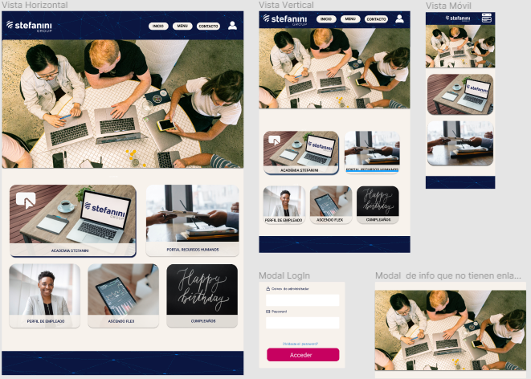

# Desafío Stefanini:Intranet Colaboradores

## Índice

* [1. Antecedentes](#1-Antecedentes)
* [2. Desafío y planificacion](#2-Desafio)
* [3. Prototipo ](#3-Prototipo)
* [4. Tecnologia usada](#4-Tecnologia_usada)

***

## 1. Antecedentes

En Stefanini Chile como empresa consultora tradicional está en su camino a
una transformación digital a nivel corporativo. Esta última tiene que ser 360°
(interno y externo) por lo que tenemos que ir digitalizando nuestros procesos
internos y que tiene que ser lo más ágil posible.
Actualmente no tenemos una plataforma que permita visualizar toda la
información que un Stefaniner (colaborador de Stefanini) debe conocer como
parte de esta empresa. Existe mucha información disgregada que se pierde en
la memoria de los empleados

 
### DATOS

Proporcionar información en una Intranet unificada, con toda la información
que el colaborador necesita. Estas son las plataformas/información a la cual
pueden acceder nuestros colaboradores:
1. Academia: https://stefanini.konviva.com.br/lms/#/home
2. Acsendo: https://hr.acsendo.com/results/admin
3. Kenoby: https://jobs.kenoby.com/stefaninilatam
4. Mentoring: https://mentoring.stefanini.io/#/login
5. Skill Mapping:https://integra.stefanini.com/portal/0103PROD/PortalSkillMapping#
6. Portal de RRHH: http://verticales.inetcloud.cl:8082/rrhh/login.aspx
7. Beneficios Corporativos
8. Información del Seguro Complementario
9. Información de cumpleaños.
10.Creación de perfil del empleado

Este producto debe ser capaz de:

I. Diseño novedoso
II. Modelo Responsivo
III. Información unificada
IV. Conexión CMS
V. Debe ser customizable

***

## 2. DESAFÍO Y PLANIFICACION

Entregar una Intranet de alto impacto, amigable y SEGURA, que contenga toda
la información necesaria que todo Stefaniner debe conocer al formar parte de
nuestra empresa.

Una vez identificadas la problematica nos organizamos en GitHub Project.

https://github.com/yuritalinda/intranet-stefanini/projects/1?fullscreen=true

 ***      
       
     

  ## 3. Prototipo

  Nuestro prototipo en alta fidelidad :https://www.figma.com/file/4ciEpUpqsoXPXtvEMLDzeS/Stefanini?node-id=0%3A1
  
  

  
  
  
  ***
  
   ### 4. Tecnología Usada
    
    React
    Html5
    Css
    Bootstrap
    Firebase
    
    

